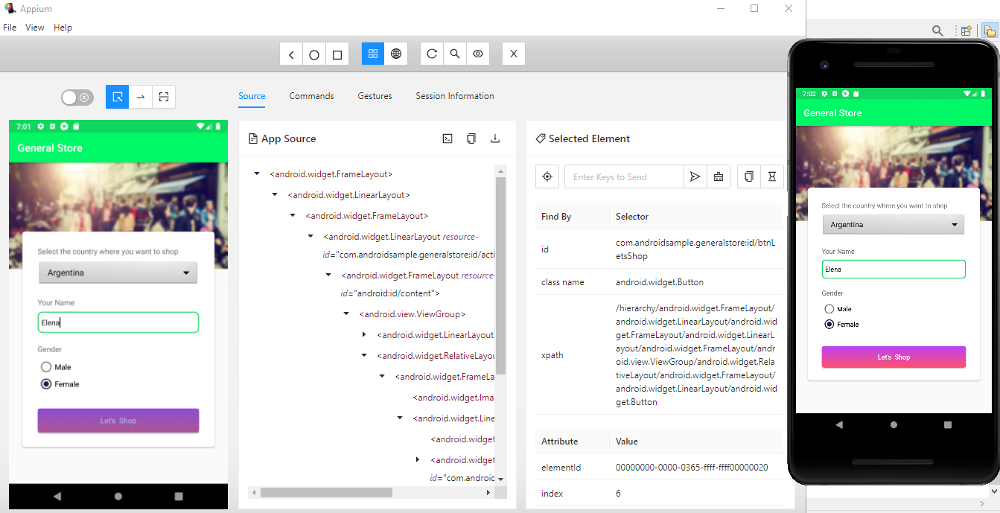
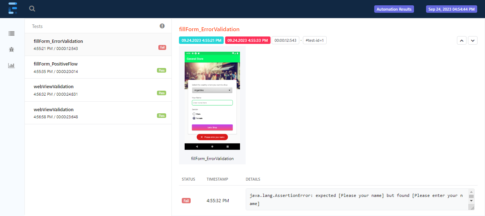

# Appium Framework Design

This project contains automated test cases implemented with Appium. A proper framework has been implemented with relevant architecture, tools and features. These include:
- Page Object Factory Design
- DataProivder with JSON parsing
- Testing Suites, Groups & Profiles
- Global Configuration Variables 
- Extent Reports
- TestNG Listeners & Screenshots
- Maven Integration with CI/CD tool Jenkins
- Jenkins Parameterization & Scheduling 

## Screenshots

 
 
 

